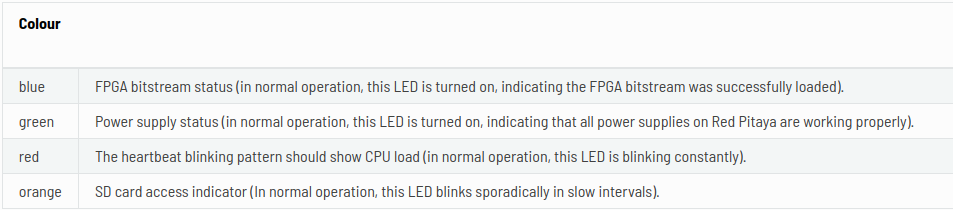

# Developer Documentation

## Hardware setup

This is the most common and recommended way of connecting and using your Red Pitaya boards. Your LAN network must have DHCP settings enabled which is true with most local networks. With this, a simple plug and play approach is enabled.

### Red Pitaya connection

1. Connect your Red Pitaya board to the router using ethernet
2. Connect the power supply to the Red Pitaya board (5V/2A)
3. Open your web browser and type rp-xxxxxx.local/ into the address bar
**NOTE: xxxxxx are the last six characters of the MAC address of your Red Pitaya board. The MAC address is written on the Ethernet connector.**

1. Find IP address of the board. After the the third step, you will get a Red Pitaya main page.
Here you can find the IP address by clicking the system->Network manager

The IP address is also shown here:

1. Connect to the Red Pitaya board via SSH: Start the terminal and type in command:

    ```ssh root@[Red_Pitaya_IP_Address]```
Replace [Red_Pitaya_IP_Address] with the IP address of your board found in *step 4*. It can also be found in the interactive web interface or in the DHCP client list on your router's web interface. Then the system will ask for the password. Type in your password.

### Signal Capture connection

- ADC Input: The ADC input is supplied via an RF input port


- Testing Trigger: The testing trigger can be provided by connectiong a square wave to the DIO0_P port.
**NOTE: Max voltage on external trigger pin is +3.3V. Direct 5V digital signals may damaged the board.**

Reference: [2.3.6.4.3. Triggering on external trigger — Red Pitaya 2.00-30 documentation](https://redpitaya.readthedocs.io/en/latest/appsFeatures/examples/acquisition/acqRF-exm3.html)

## Development Workflow

### Vivado

#### Stage_1. Project creation on PS

1. Download the projec *SQDfpgaRP/Firmware* from github, and move to the Desktop.
2. run this command to open a new Vivado window. (in the lab pc)

   ```sudo bash Vivado.sh```
3. In the tcl window of Vivado, run this command first:

   ```cd <dictionary/that/contains/tcl/file>```
    replace the *<dictionary/that/contains/tcl/file>* with the tcl location. The location is *SQDfpgaRP/Firmware* from github.
4. In the tcl window of Vivado, then run the tcl file by *source* command:
    
    ```source make.tcl```

**NOTE: Must update the tcl file when modify the project in Vivado**
1. Now the project is created in Vivado. Generate the bitstream by clicking the *Generate Bitstream* under the Flow Navigator. Click the yes and ok of the popup windows to start. Then Vivado will go through the process of Synthesis, Implementation and bitstream generation automatically.
2. Then copy the generated bit stream to the red pitaya board. There's a bash file named to_RP wrote for the 125-10 board in the lab. You need to modify the IP address based on your board in the bash file. The application is 
   
   ```to_RP <location/of/the/bitstream>/<bitstream>.bit <new/name>.bit```
   
   Or you can copy your bitstream to red pitaya via *scp* command through 
   
   ```scp <location/of/the/bitstream>/<bitstream>.bit root@rp-xxxxxx.local:/root/<newName>.bit```

#### Stage_2. Project implementation on board

1. Now establish an SSH communication with your Red Pitaya and check if you have the copy *newName.bit* in the root directory.

2. Load the your bitstream to xdevcfg with 
   
   ```cat <newName>.bit > /dev/xdevcfg``` Replace the *newName with your bitstream's name.

### Verilator

Verilator is a tool that converts Verilog and System Verilog files into C++ files to allow for easy testing. The steps to use Verilator are below.

1. Have Verilog files to test. Within the top file the following must be added to the initial block 

```verilog
$dumpfile("wave_file_name.vcd");
$dumpvars();
```

2. Write the C++ testbench.

   *  Include the header file for the top Verilog file. By default Verilator will convert a Verilog file to C++ files of the same name as the Verilog file with the prefix "V" appended to the start of the name.  This means that given a Verilog file called file.v, its corresponding C++ header file that will be generated will be called Vfile.h. Note that is the Verilog file is called Vfile.v, to our understanding the "V" prefix will not be appended. 

        This prefix can be modified by setting the prefix in the verilate command in the later CMake file.

   * Initialise the Verilog file as a C++ object with the following code

        ```C++
        void wait_n_cycles(int n);

        void wait_n_cycles(int n) {
        for (int i = 0; i < n; i++) { 
            main_time++;
        }
        

        // Keep track of simulation time (64-bit unsigned)
        vluint64_t main_time = 0;

        // Called by $time in Verilog an needed to trace waveforms
        double sc_time_stamp() {
            return main_time;  // Note does conversion to real, to match SystemC
        }

        // in main function
        Verilated::commandArgs(argc, argv);
        Verilated::traceEverOn(true);
        Vverilog_file_name* top = new Vverilog_file_name();
        }
        ```

   * Assign values to the inputs of the top Verilog file with the following syntax

    N.B. To write to ports that have a width of a non-power of 2, use nearest power of 2 that is larger than the port's width. Verilator will use bits from the LSB upwards, and ignore all extra bits. One should use unsigned data types when doing these types of operations.

        ```C++                    
        cmake -G Ninja ..
        ninja all
        ./executable_name
        gtkwave wave_file_name.vcd
        ```

   * Utilise the following code to increment the time and clock cycle

        ```C++
            // Put this somewhere in main
            top->fir_clk = 0;
            // wait_n_cycles(1); 
            // Uncomment above so that 1 clock cycle takes two time units set in the Verilog file
            top->eval(); 

            top->fir_clk = 1;
            wait_n_cycles(1);
            top->eval(); 

            main_time++;  
        ```

   * Utilise the following  CMake file template

        ```cmake
        cmake_minimum_required(VERSION 3.15)

        project(project_name)
        find_package(verilator HINTS $ENV{VERILATOR_ROOT})

        # Optional. Is only needed when adding non-verilog libraries to the testbench
        add_library(library_name STATIC library_header_file_name.h)
        set_target_properties(library_name PROPERTIES LINKER_LANGUAGE CXX)
        target_compile_features(library_name PUBLIC c_std_11)

        add_executable(executable_name main.cc)
        target_link_libraries(executable_name PUBLIC library_name)

        verilate(executable_name SOURCES verilog_file_1.v verilog_file_2.v verilog_file_3.v TOP_MODULE top_module_name VERILATOR_ARGS --trace)
        ```

   * Create a folder to build

   * Move to the build folder and run the following commands

        ```bash
        cmake -G Ninja ..
        ninja all
        ./executable_name
        gtkwave wave_file_name.vcd
        ```

Note that sometimes fixed point inputs are needed. Refer to the following article for help [Simple Fixed-Point Conversion in C](https://embeddedartistry.com/blog/2018/07/12/simple-fixed-point-conversion-in-c/)

Change ```uint16_t``` to the width needed. Contrary to the comments in the article, in our experience unsigned integer types should be used regardless of whether the input is signed or unsigned.

### C to read from memory

#### Preliminary

Communication within the SoC (both Processing System (PS) to and from the Programmable  Logic (PL) and within the PL itself) is often facilitated via ARM's AMBA AXI4 (or AXI for short) protocol. Support documents for AXI are provided below

[Documentation – Arm Developer – Protocol Specification](https://developer.arm.com/documentation/ihi0022/latest/)

[Documentation – Arm Developer – Protocol Introduction](https://developer.arm.com/documentation/102202/0300/AXI-protocol-overview)

[AMBA AXI4 Interface Protocol –  Xilinx](https://www.xilinx.com/products/intellectual-property/axi.html#overview)

[AXI Basics 1 - Introduction to AXI - Xilinx](https://support.xilinx.com/s/article/1053914?language=en_US)

Important to note is that AXI utilises addresses to read and write data to location. These addresses can be found within the Address Editor of the IP Integrator's Block Design Editor. These addresses can be used by the PS to read data from the PL. Two main approaches will be discussed, however both approaches utilise Red Pitaya's OS and being SSH'ed into the Red Pitaya Board.

#### Monitor

When SSH'ed into the Red Pitaya board, the monitor command is available. This allows for individual registers to be written and read to via addresses. Some addresses are fixed and probing them will allow for information that the Red Pitaya board the is capturing to be displayed, while other addresses (AXI addresses seen within the Address Editor) correspond to FPGA registers, thus allowing access to the PL. More information about the monitor command can be found at [2.4. Command-line tools — Red Pitaya 2.00-30 documentation](https://redpitaya.readthedocs.io/en/latest/appsFeatures/command_line_tools/com_line_tool.html#monitor-utility), with an example at [1.4.2.4. Stopwatch — Red Pitaya 2.00 documentation](https://redpitaya-knowledge-base.readthedocs.io/en/latest/learn_fpga/4_lessons/StopWatch.html).

The monitor command allows for byte-address reading, so to read words one should be reading in increments of the word address by the number of bytes per word.

This method is best for debugging.

#### DMA Via A Program

In theory the use of an exec family command with forking in a C program can allow for monitor to be used in an automated fashion. However in our experience, this method is slow (minutes long to read thousands of bytes), doesn't scale well, and if additional data processing is required would require passing data via pipes, shared memory, or some other needlessly complex data communication method.

A better approach is to use the underlying functions that the monitor command utilises to read data from the PL. The code for the monitor command can be found here [RedPitaya/Test/monitor/src at master · RedPitaya/RedPitaya](https://github.com/RedPitaya/RedPitaya/tree/master/Test/monitor/src) for reference

A tutorial for how to use a DMA is found here [Accessing BRAM In Linux - Xilinx Wiki - Confluence](https://xilinx-wiki.atlassian.net/wiki/spaces/A/pages/18842412/Accessing+BRAM+In+Linux#AccessingBRAMInLinux-3.3UserSpaceApplication)

```C
// In Linux this allows access to the memory values and thus requires the software to run with root access
char* memory_file = "/dev/mem";

unsigned int axi_size = number_of_bytes_available;
off_t axi_pbase = physical_base_address;
int memory_fd = open(memory_file, O_RDWR | O_SYNC);
int32_t* axi_vptr = (int32_t*) mmap(NULL, axi_size, PROT_READ|PROT_WRITE, MAP_SHARED, memory_fd, axi_pbase);
// Change int32_t to the width of the memory that you're reading. For the AXI BRAM Controller we use 32 bit words

for (int idx = 0; idx < bram_size + 1; idx ++) {
    printf("%d\n", bram_vptr[idx]);
}
```

To reiterate, when using the pointer provided by mmap,to read adjacent values in memory, increment or decrement the pointer by 1. The C compiler will do the memory offset in assembly for you (that is to say increment the memory address by the number of bits needed to read the next word).

### GPIO and BRAM

Now that a way of reading to and from the PL and PS has been established, we must now instantiate something to read from. Our designs utilise both the AXI GPIO IP Core and AXI BRAM Controller IP Core.

#### GPIO

Supplementary to the documentation here is Xilinx's documentation on the AXI GPIO IP Core to provide greater detail on how GPIO works, which can be found here [AMD Adaptive Computing Documentation Portal](https://docs.xilinx.com/v/u/en-US/pg144-axi-gpio).

For simple reads and writes, GPIO connections are recommended. To make reading and writing even simpler, the GPIO ports can be configure so that they function only for reading or writing. Alternatively the design below can allow for both reading and writing on the same AXI address that corresponds to the GPIO pin


If two GPIO ports are used, then the GPIO port is accessible via the base AXI address assigned to the IP Core, and the GPIO2 port is accessible via the the base AXI address plus the number of nibbles in the word length of the GPIO port.

So in the diagram above, given that GPIO is accessed at address 0x4000_0000, then GPIO2 is accessed at address 0x4000_0000 + 32/4 = 0x4000_0008.

To access GPIO in C, use index 0 with the virtual pointer created by mmap. To access GPIO2 in C, use index 0 + GPIO_word_in_nibbles with the virtual pointer created by mmap.

Reading a write port will return 0's, and writing to a read port will yield no results.

#### BRAM

To store more than 32 bits of data, using BRAM is advised. BRAM can be inferred within HDL by the synthesizer, but for ease of use the Block Memory Generator IP Core is used.  Xilinx's documentation on this core can be found here [AMD Adaptive Computing Documentation Portal](https://docs.xilinx.com/v/u/en-US/pg058-blk-mem-gen)

Additional resources can also be found below

Creating BRAM: [Design a Block RAM Memory in IP Integrator in Vivado](https://www.youtube.com/watch?v=gfpE81yMBwQ)

Simulating BRAM: [Simulating BRAM memory IP in Vivado Training](https://www.youtube.com/watch?v=SGvYkA87W20)

An example block design: [AMD Customer Community](https://support.xilinx.com/s/article/63041?language=en_US&_ga=2.255607681.864751890.1707117919-550637929.1707117919) (working version)

BRAM can be controlled via Xilinx's AXI BRAM controller. Documentation on this core can be found here AMD Adaptive Computing Documentation Portal

N.B.: The AXI BRAM controller that Xilinx provides only utilises 16 bits for addressing, and current designs can only capture 1024 32 bit integers at a time.

#### Special address in the design

- Start address of the bram: 0x4000_0000
- Start address of the GPIO controller: 0x7fff_8000
  
It is essential to double check that in the address editor and do modification for your design.

#### Initialising BRAM With .mem File

Sometimes we need to use BRAM and not ROM as ROM (as its name indicates) does not allow for rewriting. In theory one could write a controller to initialise the BRAM, however an easier way is to use a .mem file. However Xilinx doesn't make this easy, and a community sourced .tcl file is required. We will summarise the steps here, but the original documentation can be found here [AMD Customer Community](https://support.xilinx.com/s/article/63041?language=en_US&_ga=2.255607681.864751890.1707117919-550637929.1707117919)

1. Write .mem file, format like this

    ```
    @00000000
    0
    1
    2
    3
    4
    5
    6
    7
    8
    9
    A
    B
    ...
    ```

    or

    ```
    @00000000
    11111111
    22222222
    11111111
    22222222
    ...
    ```

    ```@00000000``` Refers to the base memory address of the BRAM, which can be checked in Vivado's Address Editor. The base memory of the BRAM has a mapping to the AXI address space, which can also be checked within the Address Editor.

2. Run this code under Tcl console

    ```source -quiet write_mmi.tcl```

3. To implement the script run the command below

    ```write_mmi <BRAM Name>```

Note: the BRAM name can be obtained from the implemented design. Open the implemented design, and press Ctrl+F to search for all BRAM.

This will list all of the BRAM in a design. The script uses a similar method to list all of the available BRAM. However, the user needs to provide a filter to narrow results to just the BRAM that the MMI is to be created for.

For example, below is a list of all of the BRAM in a design


So, here you would use the command ```write_mmi axi_bram_ctrl_0_bram```

This produces the result below on the console:

```
Warning: No Processor found
MMI file (design_1_wrapper.mmi) created successfully
```

4. Run updatemem, use the command line below after write_bitstream:

```
updatemem -force --meminfo C:/cases/non_processor_mmi/project_1.runs/impl_1/design_1_wrapper.mmi --data .elf/mem --bit  --proc dummy --out .bit
```

The current working command is:

```
updatemem -debug -force --meminfo blk_mem_gen_0.mmi --data project_folder/bram_init.mem --bit project_folder/project_folder.runs/impl_1/generated_bitstream.bit --proc dummy --out project_folder/project_folder.runs/impl_1/generated_bitstream.bit > debug.txt
```

which also generate the debug result to debug.txt under

project_folder/write_mmi.tcl

5. Test with the monitor Command

    1. SSH into the Red Pitaya Linux instance

    2. Flash the FPGA with the generated bitstream file

    3. Use monitor to check the base address upwards to see whether there is data in the BRAM

N.B.:

When writing into BRAM in order like this

```
@00000000 0 1 2 3 4 5 6 7 8 9 A B C D E F 10 11 12 13 14 15 16 17 18 19 1A 1B 1C
```

(Spaces and new lines don't make a difference)

The reading result from monitor is

```
monitor 0x40000000
0x67452301
monitor 0x40000004
0xefcdab89
monitor 0x40000008
0x13121110
monitor 0x4000000c
0x17161514
```

### Python to plot result

1. Send result from the board to PC via **scp** command

2. Employ **numpy** and **matplotlib.pyplot** library in python to plot the result.

Reference:

## Hardware notes

### Red-Pitaya board status LED



### Extension board

- **Ground**:The ground of extension board doesn't work properly. So the BNC connector must physically touch a metal body that can serve as a ground. In our testing, an RF output connector was used as a ground by holding the BNC connector to it.


- **Label**:The label of the extension board doesn't correspond to the extension connector on the board. It is important to refer to the schematic of the board.

### Red Pitaya

- **Red Pitaya 125-10**:
  [Red Pitaya 125-10 Schematic](https://downloads.redpitaya.com/doc/Red_Pitaya_Schematics_STEM_125-10_V1.0.pdf)
- **Red Pitaya 125-14**: The set up is similar to Red Pitaya 125-10. The key difference is that the OS will not boot without providing an external clock.
    [Red Pitaya 125-14 Schematic](https://downloads.redpitaya.com/doc//Red_Pitaya_Schematics_v1.0.1.pdf)

- **General**: The Red Pitaya is a small network-attached instrument based on the Zynq 7z010 SoC. It features two analog inputs and two analog outputs, both with 14 bits resolution and 125 MHz sampling frequency.

### ADC Input

- **RF Input Ports**: These are designed for **higher frequency** signals, typically in the MHz to GHz range.

- **Analog Input Ports**: These are typically used for **lower frequency** signals, usually up to several MHz. 

- **Valid bits**: Both 125-10 and 125-14 has 14 bit ADC. For 125-10, only 10 of the 14 bits are valid (the bits 0 (LSB) to 3 of the ADC output bus connected to ground, and therefore can be ignored). For 125-14, all 14 bits are valid.

- **Data Sheet**: [LTC2145-14/ LTC2144-14/LTC2143-14](https://www.analog.com/media/en/technical-documentation/data-sheets/21454314fa.pdf)

## Binary formats

Multiple Binary Formats are used here. Keep in mind of these formats when doing operations.

- **ADC**: The output format of ADC is excess format, where the MSB represents -1 when it's 0, and 0 when it's 1. Bits before the MSB are fractional bits. Conversion between excess format and 2's complement is done by flipping the MSB. To prevent misaligned transfers, ADC values are sent to BRAM with a sign extension by extending the MSB.

- **SIN & COS**: The sine and cosine wave values are 16 bits wide, with 2 bits for integers and 14 bits for fractions. Negative values are stored using 2's complement.

    On Red Pitaya boards, LUTs are 32 bits wide, storing 2 sine/cosine values per address. Bits 0-15 hold the first value, and bits 16-31 hold the second value. Alternatively, values may be stored in FF/DRAM based on the synthesizer.

- **IMPORTANT**: In binary multiplication, like in decimal multiplication, the position of the binary point is determined by the sum of the digits to the right of the decimal points of the multipliers. This means binary points don't have to align. However, for binary addition, alignment of the binary points is necessary. Read here for more Binary [Lesson 11 – Binary Multiplication](https://delightlylinux.wordpress.com/2014/09/25/binary-lesson-11-binary-multiplication/)
  
    As there are n-1 adders for n number of taps, in theory the number of bits that must be outputted by each adder should be k + n - 1 bits where k is the width of the multiplier output and n is the number of taps. In practice most documentation will state that k + ceil(log2(n)) bits are needed for the output.  

- **FIR filter**: The values stored for the multiplier coefficients of the FIR filter are less than 1, so all bits will be fractional values. 16 bits will be used. This is to ensure that no loss of precision occurs. The Jupyter Notebook file [insert_file] can be used to quickly check to see if more or less bits are needed to store both the largest value (which will determine the number of integer bits needed) and the smallest value (which will determine the number of fractional bits needed).

    More information on choosing word lengths for the FIR filter can be found here: <http://www.digitalsignallabs.com/fir.pdf>

- **Multiplier**: To ensure that no precision is lost during multiplication, the output of the multipliers must have a width that is at least as many bits as the widths of both of the inputs added up. (This is a general rule with all number bases, for example if given 2 denary digits the largest (integer) value that can be made via multiplication is 99 * 99 = 9801)


